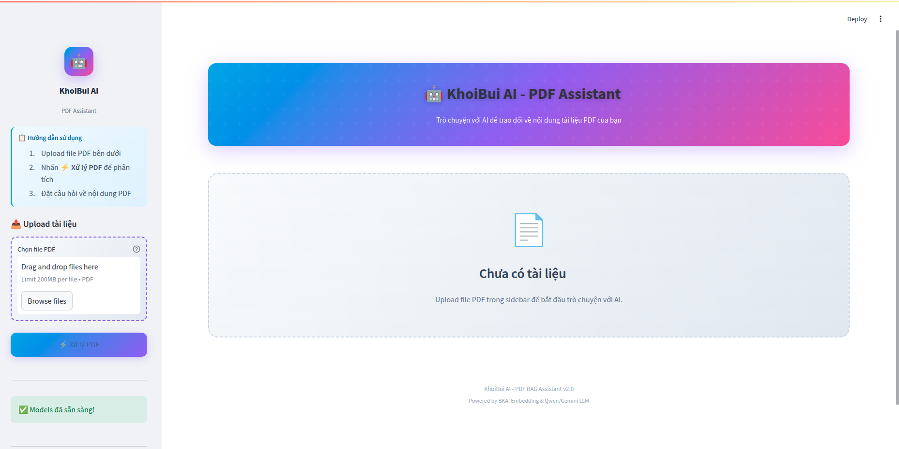

# RAG PDF Chatbot

## Description

RAG PDF Chatbot is a smart question-answering application designed for Vietnamese PDF documents. It combines advanced retrieval techniques and large language models (LLMs) to help you search, understand, and interact with your own documents. With a modern web interface, you can upload PDFs, ask questions in Vietnamese, and receive accurate, context-aware answers grounded in your data. The system is optimized for Vietnamese language processing and supports both local and cloud-based AI models.

## Overview

- **Retrieval-Augmented Generation (RAG):** Combines document retrieval with generative AI for grounded, reliable answers.
- **PDF Support:** Upload and query Vietnamese PDF documents.
- **Modern Stack:** Uses LangChain, HuggingFace, Streamlit, and Chroma vector database.
- **Flexible Models:** Supports both local (GPU) and API-based (Google Gemini) LLMs and embeddings.
- **User Interface:** Clean, interactive web UI built with Streamlit.



## Main Features

- **PDF Chunking:** Load PDF files and split their content into meaningful chunks (by paragraph or character count) for efficient retrieval.
- **Vector Indexing:** Convert each chunk into a vector embedding and store it in a Chroma vector database for fast similarity search.
- **Retrieval & Reranking:** Retrieve the most relevant chunks using MMR and rerank them with a cross-encoder to provide the best answer.
- **Vietnamese Optimization:** All processing, prompting, and reranking are tailored for Vietnamese language.
- **Session Management:** Remembers chat history and document state for each user session, ensuring a smooth experience.

## Project Structure

```
RAG_PDF_Chatbot/
│
├── app.py                  # Main Streamlit app entry point
├── requirements.txt        # Python dependencies
├── README.md               # Project documentation
├── .gitignore              # Files/folders to ignore in git
│
├── asserts/                # Static assets (images, icons, etc.)
│   └── logo.png            # Example logo file
│
├── data/                   # Example data (PDFs, etc.)
│   └── MLyearning_vietnamese.pdf # Example PDF file
│
├── notebooks/              # Jupyter notebooks for experiments
│   └── Rag.ipynb
│
└── src/                    # All main source code
    ├── __init__.py
    ├── config.py           # Configuration settings
    ├── chat_handler.py     # Main RAG pipeline and QA logic
    ├── models.py           # LLM and embedding model loading
    ├── pdf_processor.py    # PDF loading and chunking
    ├── reranker.py         # Cross-encoder reranking
    ├── state_manager.py    # Streamlit session state management
    ├── ui_components.py    # Streamlit UI components
    └── utils.py            # Utility functions
```

## How to Install & Run

### 1. Clone the repository

```bash
git clone https://github.com/KhoiBui16/RAG_PDF_Chatbot.git
cd RAG_PDF_Chatbot
```

### 2. Create a Conda environment (Python 3.11 recommended)

```bash
conda create -n ragpdf python=3.11
conda activate ragpdf
```

### 3. Install dependencies

```bash
pip install -r requirements.txt
```

### 4. Run the Streamlit app

```bash
streamlit run app.py
```

## Technologies Used

- Python=3.11+
- Streamlit
- LangChain
- HuggingFace
- Transformers
- Chroma
- Google Gemini API (optional)

## Contact

- github: [KhoiBui16](https://github.com/KhoiBui16)
- gmail: [khoib1601@gmail.com](mailto:khoib1601@gmail.com)
git add .